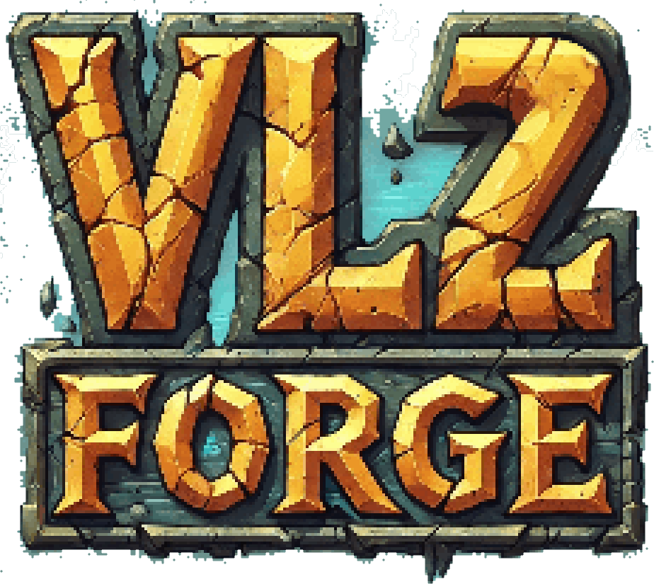

# 

**[exogen.github.io/vl2-forge](https://exogen.github.io/vl2-forge/)**

Create and combine VL2 files for Tribes 2.

Use the add button or drag & drop to add files. Existing VL2s will be extracted
so that their contents can be easily merged with others.

> [!TIP]
> Double-click a filename to rename. This can be used to put files in a
> different folder.
